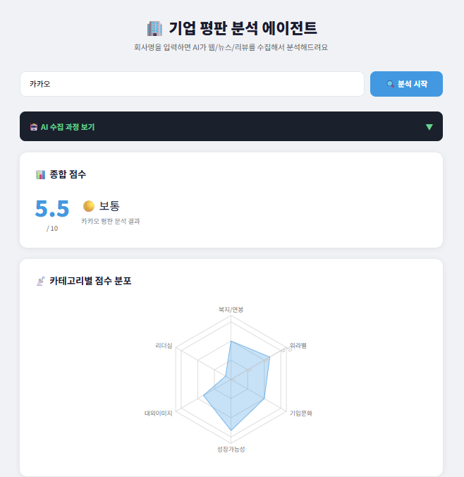
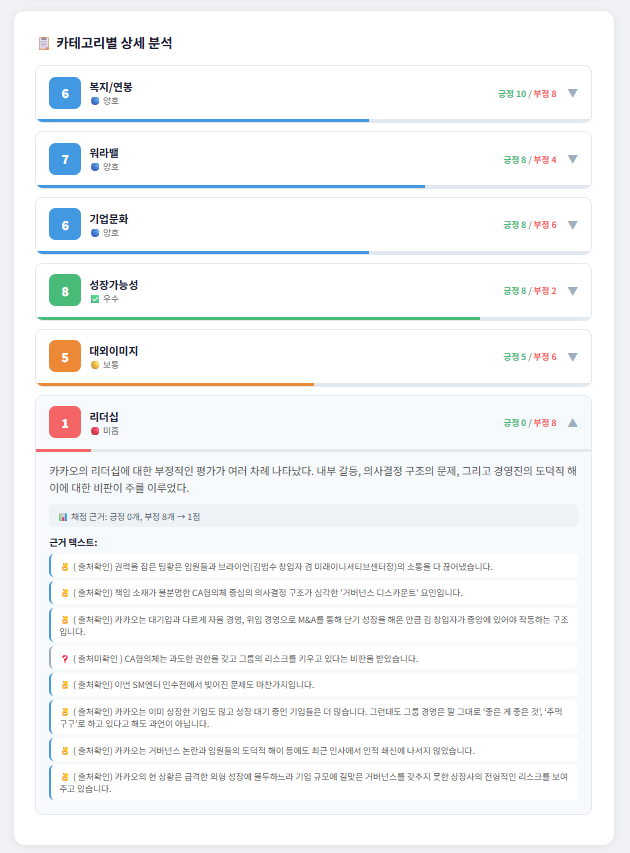
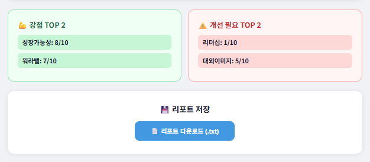

# 🏢 기업 평판 분석 AI 에이전트

> OpenAI function calling 기반 agentic 시스템으로 기업 평판을 자동 수집·분석·시각화합니다.

<br>

## 📌 프로젝트 개요

회사명을 입력하면 AI 에이전트가 스스로 필요한 정보를 판단하고, 웹/뉴스/리뷰 등 다양한 소스에서 데이터를 수집합니다. 수집된 텍스트를 카테고리별로 분류·점수화하여 기업 평판 리포트를 자동 생성합니다.

<br>

## 🎬 데모


### 분석 결과


### 카테고리별 상세 분석


### 다운로드


<br>

## 🏗️ 아키텍처

```
사용자 입력 (회사명)
        ↓
[Orchestrator] ← OpenAI function calling
  LLM이 스스로 도구 선택 및 실행 판단
        ↓ (병렬 실행)
┌──────────────────────────────────────┐
│  search_company_news      (뉴스)      │
│  search_company_culture   (문화/복지) │
│  search_company_review    (직원 리뷰) │
│  search_company_growth    (성장성)    │
│  search_company_leadership (리더십)  │
│  search_company_image     (대외이미지)│
└──────────────────────────────────────┘
        ↓
[Analyzer] ← OpenAI GPT-4o-mini
  카테고리별 텍스트 분류 + 긍정/부정 카운트
  점수 = 코드 공식으로 직접 계산
        ↓
[Reporter]
  리포트 생성 + Streamlit UI 시각화
```

<br>

## ✨ 주요 기능

- **Agentic 수집**: LLM이 6개 도구 중 필요한 것을 스스로 선택해 최대 3라운드 반복 수집
- **병렬 검색**: `ThreadPoolExecutor`로 다수 검색을 동시 실행해 수집 시간 단축
- **카테고리별 분석**: 복지/연봉, 워라밸, 기업문화, 성장가능성, 대외이미지, 리더십 6개 카테고리
- **투명한 점수화**: LLM이 긍정/부정 개수만 카운트 → 코드 공식으로 점수 계산 (일관성 보장)
- **근거 검증**: LLM이 제시한 근거 텍스트가 실제 수집 원문에 존재하는지 자동 검증
- **한국어 필터링**: 수집 후 한국어 문서만 필터링해 관련성 높은 결과 확보
- **Streamlit UI**: 레이더 차트, 카테고리별 상세 분석, 리포트 다운로드

<br>

## 🛠️ 기술 스택

| 구분 | 기술 |
|---|---|
| Language | Python 3.11 |
| AI | OpenAI GPT-4o-mini (function calling) |
| 검색 | Tavily API |
| UI | Streamlit, Plotly |
| 비동기 | concurrent.futures (ThreadPoolExecutor) |
| 환경 관리 | Anaconda, python-dotenv |

<br>

## 📁 프로젝트 구조

```
company-reputation-agent/
├── src/
│   ├── tools/
│   │   ├── web_search.py     # Tavily 검색 도구 (6개 함수)
│   │   └── scraper.py        # 크롤링 모듈 (확장용)
│   ├── orchestrator.py       # Agentic 루프 + function calling
│   ├── analyzer.py           # 텍스트 분류 + 점수화
│   └── reporter.py           # 리포트 생성 + 저장
├── app.py                    # Streamlit UI
├── main.py                   # CLI 진입점
├── requirements.txt
└── .env                      # API 키 (gitignore 처리)
```

<br>

## ⚙️ 설치 및 실행

### 1. 환경 설정
```bash
conda create -n reputation-agent python=3.11 -y
conda activate reputation-agent
pip install -r requirements.txt
```

### 2. API 키 설정
`.env` 파일 생성 후 아래 내용 입력:
```
OPENAI_API_KEY=sk-...
TAVILY_API_KEY=tvly-...
```

### 3. 실행

**Streamlit UI:**
```bash
streamlit run app.py
```

**CLI:**
```bash
python main.py
```

<br>

## 📊 분석 결과 예시

```
📊 종합 점수: ███████░░░ 7.2/10  🔵 양호

📋 카테고리별 상세 분석

▶ 성장가능성
  점수: ████████░░ 8/10  ✅ 우수
  긍정: 10개 / 부정: 2개
  요약: AI·커머스·핀테크 사업의 고른 성장으로 역대 최대 실적 달성
  채점 근거: 긍정 10개, 부정 2개 → 8점

▶ 리더십
  점수: ██████░░░░ 6/10  🔵 양호
  긍정: 5개 / 부정: 4개
  요약: 창업자 복귀로 전략 방향성 강화, 기존 대표 리더십 약화 우려 공존
  채점 근거: 긍정 5개, 부정 4개 → 6점
```

<br>

## 🔍 점수 계산 방식

LLM의 주관적 판단 대신 **긍정/부정 비율 기반 공식**으로 점수를 계산합니다.

| 긍정 비율 | 점수 |
|---|---|
| 95% 이상 | 10점 |
| 85% 이상 | 9점 |
| 75% 이상 | 8점 |
| 65% 이상 | 7점 |
| 55% 이상 | 6점 |
| 45% 이상 | 5점 |
| 35% 이상 | 4점 |
| 25% 이상 | 3점 |
| 15% 이상 | 2점 |
| 15% 미만 | 1점 |
| 근거 2개 미만 | null |

<br>

## 🚀 개선 이력

- LLM 점수화 → 코드 공식 점수화로 교체 (일관성 확보)
- 단일 프롬프트 분석 → 카테고리별 분리 분석 (정확도 향상)
- 고정 도구 실행 → OpenAI function calling 기반 agentic 루프
- 영어 뉴스 혼입 → 한국어 필터링 적용
- 리더십/대외이미지 전용 검색 함수 추가
- 모든 검색 함수 긍정/부정 균형 수집으로 개선
